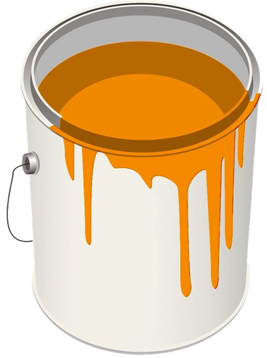

# Falta cor aqui

Página estática, sem backend. A tela começa vazia de cor; a pessoa precisa
encontrar um pincel escondido na composição, arrastá-lo para pintar, descobrir
o balde para recarregar a tinta, e cobrir a tela até ela se completar — o que
revela a chave.

## 1. Onde colocar os seus dois assets

Coloque suas duas imagens (pincel e balde de tinta) dentro da pasta
`assets/`, com estes nomes exatos:

```
assets/pincel.png
assets/balde.png
```

Se suas imagens tiverem outra extensão (`.svg`, `.webp` etc.), abra o
`index.html` e ajuste as duas linhas perto do final do `<body>`:

```html


```

Até você colocar as imagens reais, os caminhos ficarão "quebrados" (sem
imagem visível) — isso é esperado.

## 2. Como alterar a chave

Abra `script.js` e edite os grupos numéricos no início do arquivo, na seção
`CONFIGURAÇÃO DO PRESENTE`. Cada número é o código de um caractere, e cada
grupo se torna um bloco separado por hífen. Por exemplo, `65, 66, 67`
representa `ABC`.

```js
const GIFT_KEY_PARTS = [
  [67, 79, 76, 79, 81, 81, 85, 69],
  [65, 67, 72, 65, 86, 69]
];
```

A chave não aparece em nenhum lugar do HTML e só é reconstruída e escrita na
tela via JavaScript depois que a tela é completamente pintada. Isso evita a
descoberta casual, mas não é segurança criptográfica: em um site estático, o
conteúdo ainda pode ser inspecionado por alguém determinado.

## 3. Outros ajustes rápidos

No topo de `script.js`:
- `INK_CAPACITY`: quanto de tinta o pincel carrega por recarga.
- `INK_PER_PIXEL`: quão rápido a tinta acaba enquanto se pinta.
- `PAINT_RADIUS`: espessura da pincelada.
- `PAINT_COLOR`: cor da tinta, em HSL (`h`, `s`, `l`).

No topo de `style.css`, dentro de `:root`:
- `--bg`: cor de fundo inicial (sem cor).
- `--brush-size` / `--bucket-size`: tamanho dos dois objetos na tela.

Textos ("Falta cor aqui.", "Agora sim.", etc.) ficam diretamente no
`index.html`, dentro da `<main class="scene">`.

## 4. Como testar localmente

Abra `index.html` diretamente no navegador. Para testar no celular também é
possível: sirva a pasta localmente (por exemplo, com a extensão "Live
Server" do VS Code, ou `python3 -m http.server` dentro da pasta) e acesse
pelo IP da sua máquina na mesma rede.

## 5. Como publicar no GitHub Pages

1. Crie um repositório novo no GitHub.
2. Envie todo o conteúdo desta pasta, incluindo a subpasta `assets/` já com
   suas duas imagens dentro:
   ```
   index.html
   style.css
   script.js
   README.md
   assets/pincel.png
   assets/balde.png
   ```
3. No repositório, vá em **Settings → Pages**.
4. Em "Build and deployment", selecione **Deploy from a branch**, escolha a
   branch principal (`main`) e a pasta `/ (root)`.
5. Salve. Em alguns minutos o GitHub fornecerá o link público da página.

## Publicar em outras plataformas

- **Netlify**: arraste esta pasta (com `assets/` preenchida) para
  app.netlify.com/drop.
- **Vercel**: `vercel` na pasta via CLI, ou importe o repositório no painel.
- **Cloudflare Pages**: conecte o repositório ou faça upload direto da pasta.

Não há build step — os arquivos já estão prontos para produção assim que as
imagens forem adicionadas.
